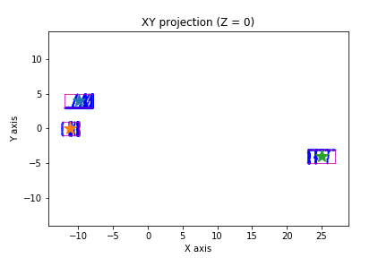
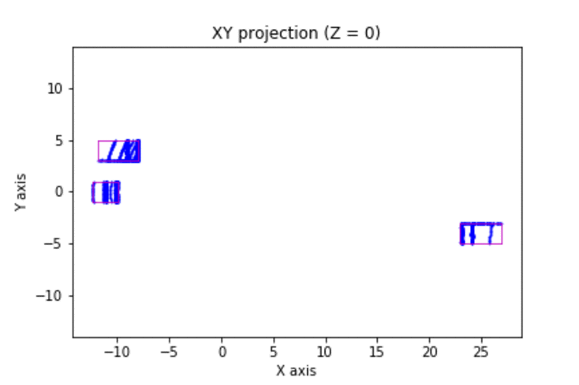

# lidar_ground_plane_and_obstacles_detections
This repo includes Python and C++ implementations/examples that show how to process 3-D Lidar data by segmenting the ground plane and finding obstacles. 



The repo also includes examples of using segementation and clustering results, in combination with Kalman Filters (KF) for vehicle tracking applications, as shown in the following animation.



## Python Implementation

### Libraries and Files

For the Python implementation, I use strawlab/python-pcl (https://github.com/strawlab/python-pcl), a small python binding to the point cloud library (PCL). As of August 2019, the majority of the wrapped APIs only work with `PointXYZ` point type. If the point type is of the format of `PointXYZI`, simple conversion is required, as shown in the following example.

```
cloud_XYZI = pcl.load_XYZI('data_1/0000000006.pcd')
cloud_np = np.array(cloud_XYZI)
cloud_XYZ = pcl.PointCloud()
cloud_XYZ.from_array(cloud_np[:, 0:3])
```

### Down-sampling
#### Voxel Grid
Voxel grid filtering will create a cubic grid and will filter the cloud by only leaving a single point per voxel cube, so the larger the cube length the lower the resolution of the point cloud.

The key parameters of voxel grid filtering is the leaf size.

```
def voxel_filter(cloud, leaf_size):
    """
    Input parameters:
    cloud: input point cloud to be filtered
    leaf_size: a list of leaf_size for X, Y, Z 
    Output:
    cloud_voxel_filtered: voxel-filtered cloud
    """
    sor = cloud.make_voxel_grid_filter()
    size_x, size_y, size_z = leaf_size
    sor.set_leaf_size(size_x, size_y, size_z)
    cloud_voxel_filtered = sor.filter()
    
    return cloud_voxel_filtered

```

Here, a `cloud.make_voxel_grid_filter()` filter is created with a leaf size specified by `leaf_size', the input data is passed, and the output is computed and stored in cloud_filtered.

#### Region of Interest (ROI)

First a 3D box is specified. Any points outside that box are filtered out. 

```
def roi_filter(cloud, x_roi, y_roi, z_roi):
    """
    Input Parameters:
        cloud: input point cloud
        x_roi: ROI range in X
        y_roi: ROI range in Y
        z_roi: ROI range in Z
    
    Output:    
        ROI region filtered point cloud
    """
    clipper = cloud.make_cropbox()
    cloud_roi_filtered= pcl.PointCloud()
    xc_min, xc_max = x_roi
    yc_min, yc_max = y_roi
    zc_min, zc_max = z_roi
    clipper.set_MinMax(xc_min, yc_min, zc_min, 0, xc_max, yc_max, zc_max, 0)
    cloud_roi_filtered =clipper.filter()
    return cloud_roi_filtered
```

### Plane Segmentation

RANSAC stands for Random Sample Consensus, and is a method for detecting outliers in data. RANSAC runs for a max number of iterations, and returns the model with the best fit. Each iteration randomly picks a subsample of the data and fits a model through it, such as a line or a plane. Then the iteration with the highest number of inliers or the lowest noise is used as the best model.
There are two key parameters for plane segmentation, a distance threshold and maximal number of iteration. The points whose distances to the fitted plane are with in the distance threshold are counted as inliers. After a maximal number of iteration, the iteration that has the highest number of inliers is then the has the best fit. 


```
def plane_segmentation(cloud, dist_thold, max_iter):
    """
    Input parameters:
        cloud: Input cloud
        dist_thold: distance threshold
        max_iter: maximal number of iteration
    Output:
        indices: list of indices of the PCL points that belongs to the plane
        coefficient: the coefficients of the plane-fitting (e.g., [a, b, c, d] for ax + by +cz + d =0)
    """
    seg = cloud.make_segmenter_normals(ksearch=50)# For simplicity,hard coded
    seg.set_optimize_coefficients(True)
    seg.set_model_type(pcl.SACMODEL_NORMAL_PLANE)
    seg.set_method_type(pcl.SAC_RANSAC)
    seg.set_distance_threshold(dist_thold)
    seg.set_max_iterations(max_iter)
    indices, coefficients = seg.segment()
    return indices, coefficients

```
### Obstacle Clustering

We have three key parameters: tolerance, minimal number of points to form a cluster, and maximal number of points to form a cluster. Tolerance is the radius of search sphere specifiec for a given cloud point (this torlerance is normally the same for each cloud point). Note that choosing an appropriate value for tolerance is crucial. If tolerance is set to be too small, an actual object could  be seen as multiple clusters. On the other hand, the value is set to be too high, multiple objects could be seen as a single cluster. 

```
def clustering(cloud, tol, min_size, max_size):
    """
    Input parameters:
        cloud: Input cloud
        tol: tolerance
        min_size: minimal number of points to form a cluster
        max_size: maximal number of points that a cluster allows 
    Output:
        cluster_indices: a list of list. Each element list contains the indices of the points that belongs to
                         the same cluster
    """
    tree = cloud.make_kdtree()
    ec = cloud.make_EuclideanClusterExtraction()
    ec.set_ClusterTolerance(tol)
    ec.set_MinClusterSize(min_size)
    ec.set_MaxClusterSize(max_size)
    ec.set_SearchMethod(tree)
    cluster_indices = ec.Extract()
    return cluster_indices
```
